<a href="https://www.material-tailwind.com">
    
    <h1 align="center">Material Tailwind</h1>
</a>
</br>
<p align="center">
  <a href="https://github.com/creativetimofficial/material-tailwind/blob/main/LICENSE">
    
  </a>
  <a href="https://www.npmjs.com/package/@material-tailwind/react">
    
  </a>
  <a href="https://github.com/creativetimofficial/material-tailwind/releases">
    
  </a>
</p>
<p align="center">
  <a href="https://github.com/creativetimofficial/material-tailwind/blob/main/LICENSE">
    
  </a>
  <a href="https://www.npmjs.com/package/@material-tailwind/html">
    
  </a>
  <a href="https://github.com/creativetimofficial/material-tailwind/releases">
    
  </a>
</p>

<p align="center">
  <a href="https://vercel.com/?utm_source=ct-tailwind-team&utm_campaign=oss" target="_blank" rel="noopener noreferrer">
     
  </a>
</p>

<br />
<br />

## @material-tailwind/react

### Documentation

Visit <a href="https://www.material-tailwind.com/docs/react/installation">https://www.material-tailwind.com/docs/react/installation</a> for full documentation.

<br />

### Components

<table>
  <tr>
    <td width="33.3333%">Accordion</td>
    <td width="33.3333%">Alert</td>
    <td width="33.3333%">Avatar</td>
  </tr>
  <tr>
    <td width="33.3333%" style="padding: 0;">
      <a href="https://www.material-tailwind.com/docs/react/accordion">
        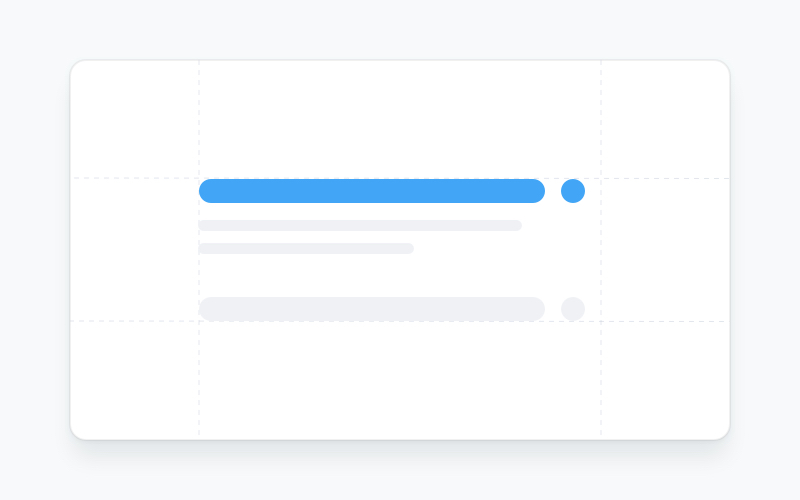
      </a>
    </td>
    <td width="33.3333%" style="padding: 0;">
      <a href="https://www.material-tailwind.com/docs/react/alert">
        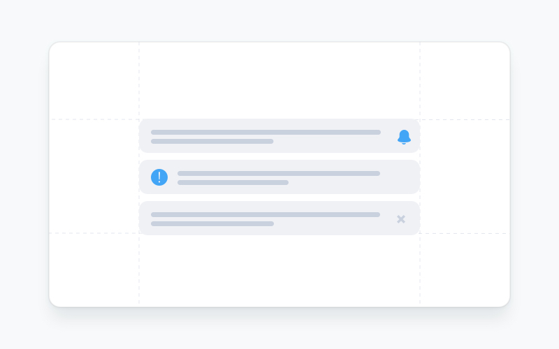
      </a>
    </td>
    <td width="33.3333%" style="padding: 0;">
      <a href="https://www.material-tailwind.com/docs/react/avatar">
        
      </a>
    </td>
  </tr>
  <tr>
    <td width="33.3333%">Breadcrumbs</td>
    <td width="33.3333%">Button</td>
    <td width="33.3333%">Card</td>
  </tr>
  <tr>
    <td width="33.3333%" style="padding: 0;">
      <a href="https://www.material-tailwind.com/docs/react/breadcrumbs">
        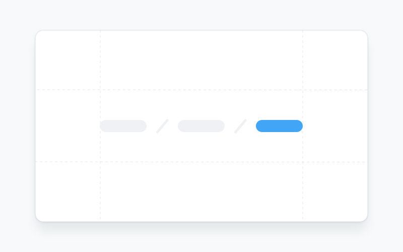
      </a>
    </td>
    <td width="33.3333%" style="padding: 0;">
      <a href="https://www.material-tailwind.com/docs/react/button">
        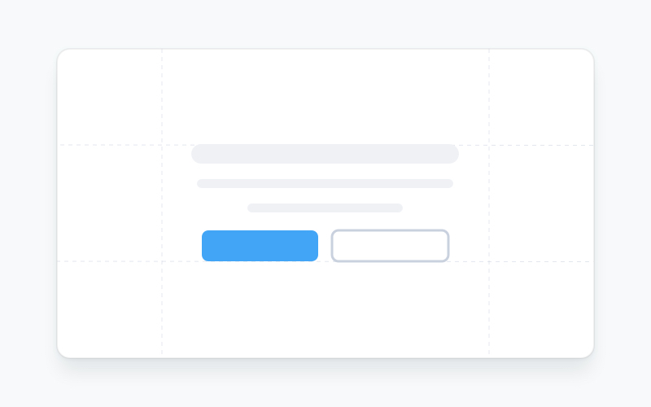
      </a>
    </td>
    <td width="33.3333%" style="padding: 0;">
      <a href="https://www.material-tailwind.com/docs/react/card">
        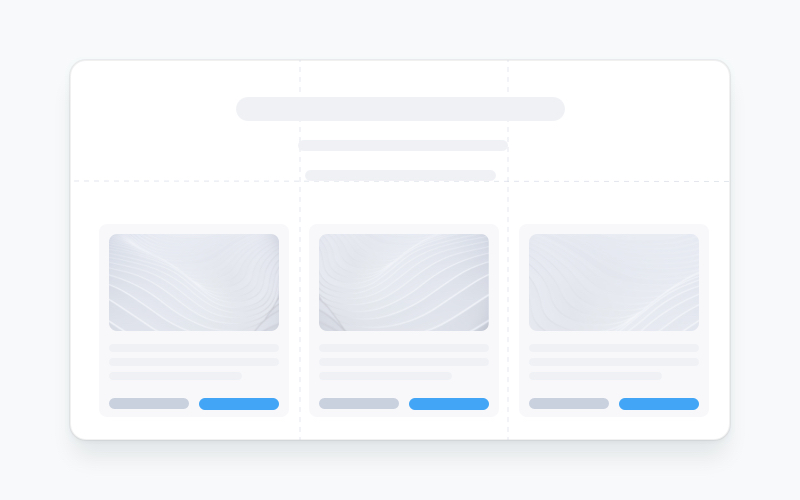
      </a>
    </td>
  </tr>
  <tr>
    <td width="33.3333%">Checkbox</td>
    <td width="33.3333%">Chip</td>
    <td width="33.3333%">Dialog</td>
  </tr>
  <tr>
    <td width="33.3333%" style="padding: 0;">
      <a href="https://www.material-tailwind.com/docs/react/checkbox">
        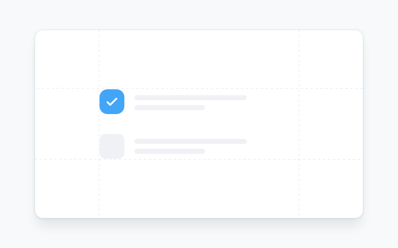
      </a>
    </td>
    <td width="33.3333%" style="padding: 0;">
      <a href="https://www.material-tailwind.com/docs/react/chip">
        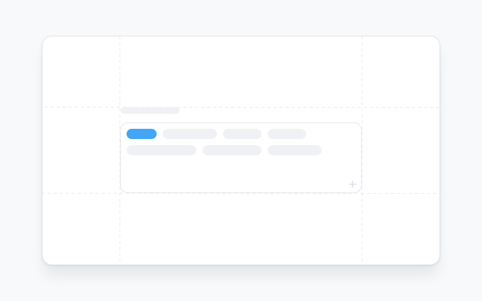
      </a>
    </td>
    <td width="33.3333%" style="padding: 0;">
      <a href="https://www.material-tailwind.com/docs/react/dialog">
        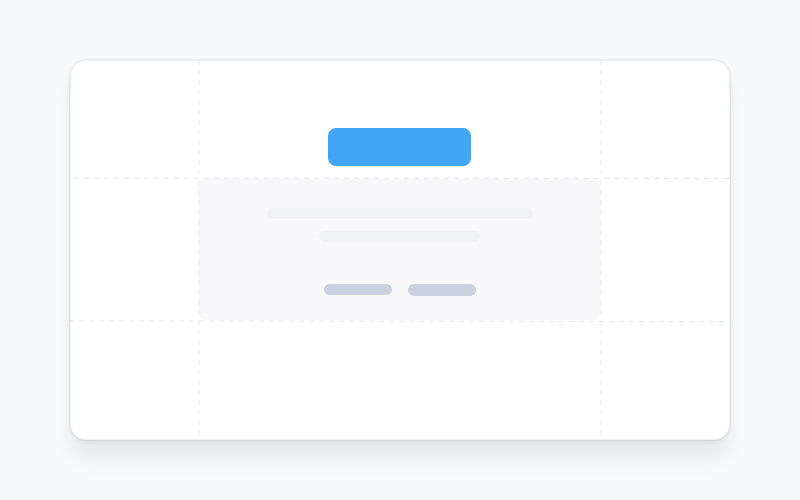
      </a>
    </td>
  </tr>
  <tr>
    <td width="33.3333%">Icon Button</td>
    <td width="33.3333%">Input</td>
    <td width="33.3333%">Menu</td>
  </tr>
  <tr>
    <td width="33.3333%" style="padding: 0;">
      <a href="https://www.material-tailwind.com/docs/react/icon-button">
        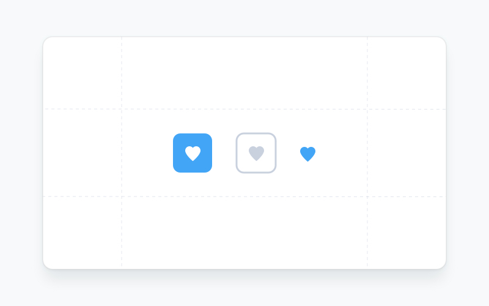
      </a>
    </td>
    <td width="33.3333%" style="padding: 0;">
      <a href="https://www.material-tailwind.com/docs/react/input">
        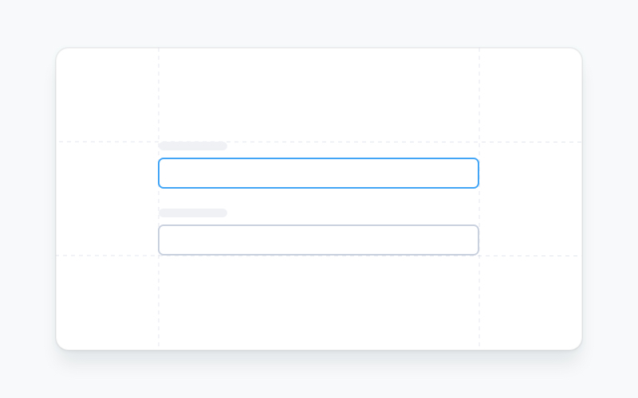
      </a>
    </td>
    <td width="33.3333%" style="padding: 0;">
      <a href="https://www.material-tailwind.com/docs/react/menu">
        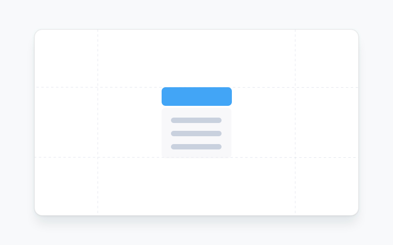
      </a>
    </td>
  </tr>
  <tr>
    <td width="33.3333%">Navbar</td>
    <td width="33.3333%">Popover</td>
    <td width="33.3333%">Progress Bar</td>
  </tr>
  <tr>
    <td width="33.3333%" style="padding: 0;">
      <a href="https://www.material-tailwind.com/docs/react/navbar">
        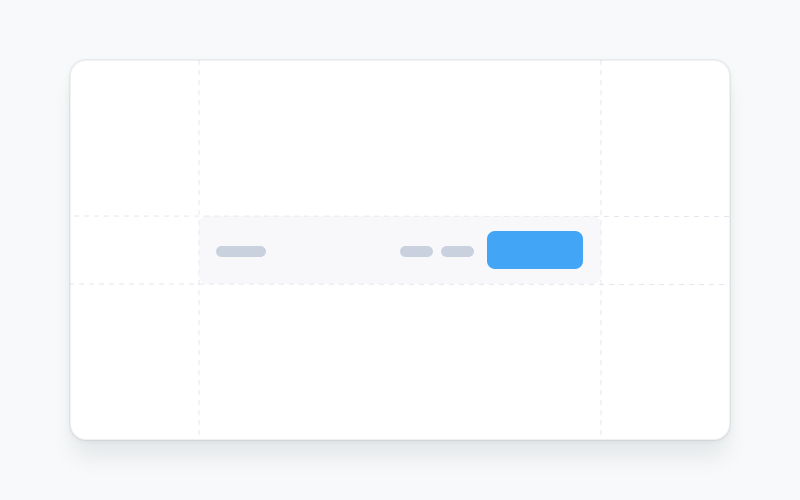
      </a>
    </td>
    <td width="33.3333%" style="padding: 0;">
      <a href="https://www.material-tailwind.com/docs/react/popover">
        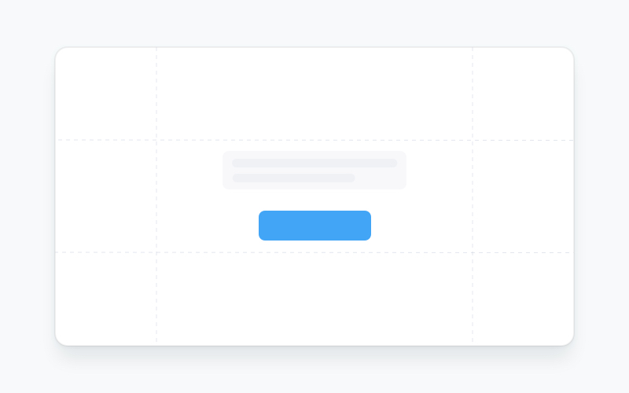
      </a>
    </td>
    <td width="33.3333%" style="padding: 0;">
      <a href="https://www.material-tailwind.com/docs/react/progress-bar">
        
      </a>
    </td>
  </tr>
  <tr>
    <td width="33.3333%">Radio Button</td>
    <td width="33.3333%">Select</td>
    <td width="33.3333%">Switch</td>
  </tr>
  <tr>
    <td width="33.3333%" style="padding: 0;">
      <a href="https://www.material-tailwind.com/docs/react/radio-button">
        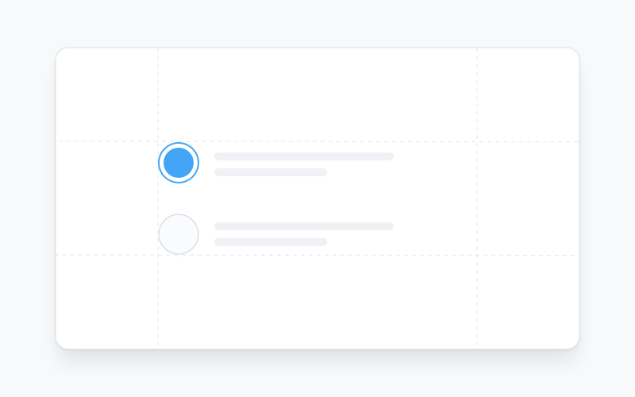
      </a>
    </td>
    <td width="33.3333%" style="padding: 0;">
      <a href="https://www.material-tailwind.com/docs/react/select">
        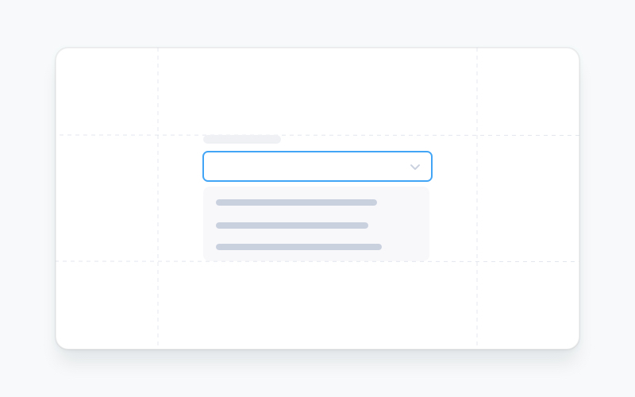
      </a>
    </td>
    <td width="33.3333%" style="padding: 0;">
      <a href="https://www.material-tailwind.com/docs/react/switch">
        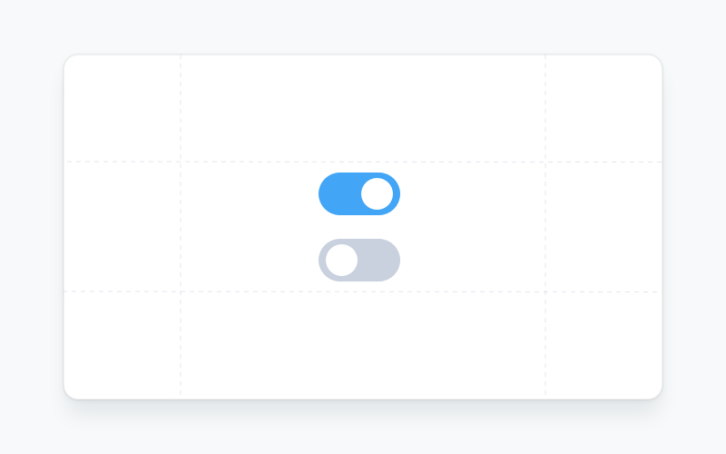
      </a>
    </td>
  </tr>
  <tr>
    <td width="33.3333%">Tabs</td>
    <td width="33.3333%">Textarea</td>
    <td width="33.3333%">Tooltip</td>
  </tr>
  <tr>
    <td width="33.3333%" style="padding: 0;">
      <a href="https://www.material-tailwind.com/docs/react/tabs">
        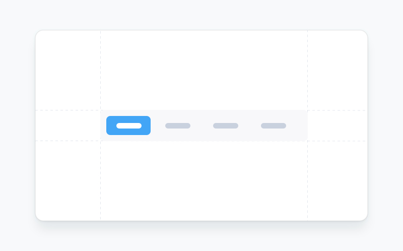
      </a>
    </td>
    <td width="33.3333%" style="padding: 0;">
      <a href="https://www.material-tailwind.com/docs/react/textarea">
        
      </a>
    </td>
    <td width="33.3333%" style="padding: 0;">
      <a href="https://www.material-tailwind.com/docs/react/tooltip">
        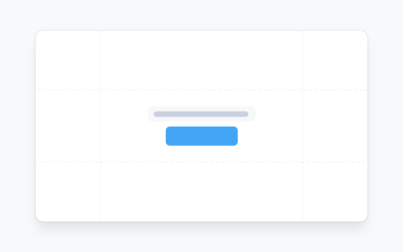
      </a>
    </td>
  </tr>
  <tr>
    <td width="33.3333%">Typography</td>
  </tr>
  <tr>
    <td width="33.3333%" style="padding: 0;">
      <a href="https://www.material-tailwind.com/docs/react/typography">
        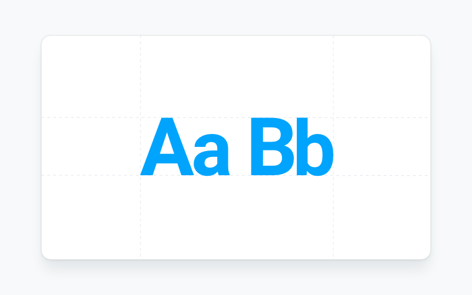
      </a>
    </td>
  </tr>
</table>

<br />

### Getting Started

Learn how to use @material-tailwind/react components to quickly and easily create elegant and flexible pages using Tailwind CSS.

@material-tailwind/react is working with Tailwind CSS classes and you need to have Tailwind CSS installed on your project - <a href="https://tailwindcss.com/docs/installation/framework-guides?ref=material-tailwind" target="_blank">Tailwind CSS Installation.</a>

<br />

1. Intall `@material-tailwind/react`.

```bash
npm i @material-tailwind/react
```

<br />

2. Once you install @material-tailwind/react you need to wrap your tailwind css configurations with the `withMT()` function coming from @material-tailwind/react/utils.

```js
const withMT = require("@material-tailwind/react/utils/withMT");

module.exports = withMT({
  content: ["./src/**/*.{js,jsx,ts,tsx}"],
  theme: {
    extend: {},
  },
  plugins: [],
});
```

<br />

3. @material-tailwind/react comes with a theme provider that set's the default theme/styles for components or to provide your own theme/styles to your components. You need to wrap your entire application with the `ThemeProvider` coming from @material-tailwind/react.

```jsx
import React from "react";
import ReactDOM from "react-dom/client";
import App from "./App";

// @material-tailwind/react
import { ThemeProvider } from "@material-tailwind/react";

const root = ReactDOM.createRoot(document.getElementById("root"));

root.render(
  <React.StrictMode>
    <ThemeProvider>
      <App />
    </ThemeProvider>
  </React.StrictMode>
);
```

<br />

4. Congratulations 🥳, you did it, now you're ready to use @material-tailwind/react.

```jsx
import { Button } from "@material-tailwind/react";

export default function Example() {
  return <Button>Button</Button>;
}
```

<br />

## @material-tailwind/html

### Documentation

Visit <a href="https://www.material-tailwind.com/docs/html/installation">https://www.material-tailwind.com/docs/html/installation</a> for full documentation.

<br />

### Components

<table>
  <tr>
    <td width="33.3333%">Accordion</td>
    <td width="33.3333%">Alert</td>
    <td width="33.3333%">Avatar</td>
  </tr>
  <tr>
    <td width="33.3333%" style="padding: 0;">
      <a href="https://www.material-tailwind.com/docs/html/accordion">
        
      </a>
    </td>
    <td width="33.3333%" style="padding: 0;">
      <a href="https://www.material-tailwind.com/docs/html/alert">
        
      </a>
    </td>
    <td width="33.3333%" style="padding: 0;">
      <a href="https://www.material-tailwind.com/docs/html/avatar">
        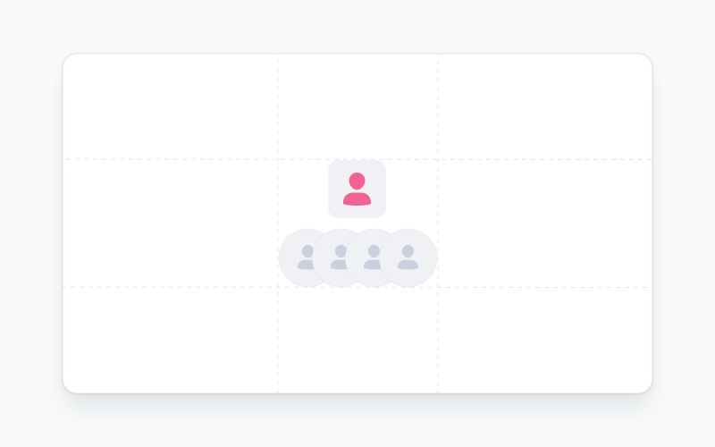
      </a>
    </td>
  </tr>
  <tr>
    <td width="33.3333%">Breadcrumbs</td>
    <td width="33.3333%">Button</td>
    <td width="33.3333%">Card</td>
  </tr>
  <tr>
    <td width="33.3333%" style="padding: 0;">
      <a href="https://www.material-tailwind.com/docs/html/breadcrumbs">
        
      </a>
    </td>
    <td width="33.3333%" style="padding: 0;">
      <a href="https://www.material-tailwind.com/docs/html/button">
        
      </a>
    </td>
    <td width="33.3333%" style="padding: 0;">
      <a href="https://www.material-tailwind.com/docs/html/card">
        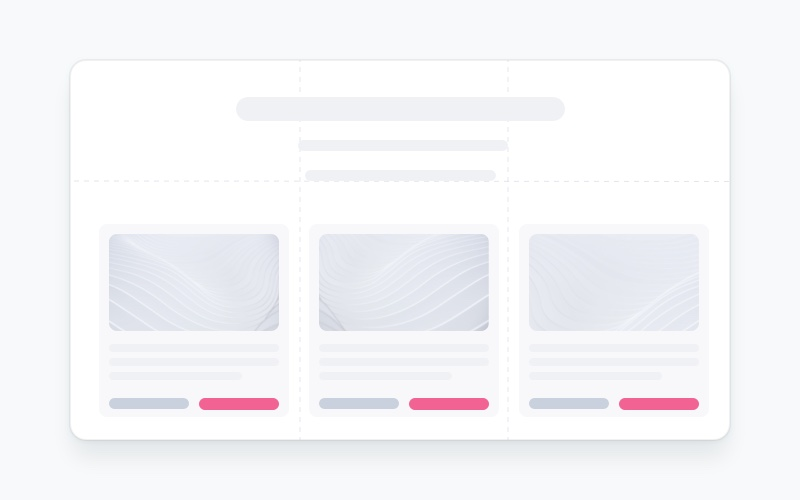
      </a>
    </td>
  </tr>
  <tr>
    <td width="33.3333%">Checkbox</td>
    <td width="33.3333%">Chip</td>
    <td width="33.3333%">Dialog</td>
  </tr>
  <tr>
    <td width="33.3333%" style="padding: 0;">
      <a href="https://www.material-tailwind.com/docs/html/checkbox">
        
      </a>
    </td>
    <td width="33.3333%" style="padding: 0;">
      <a href="https://www.material-tailwind.com/docs/html/chip">
        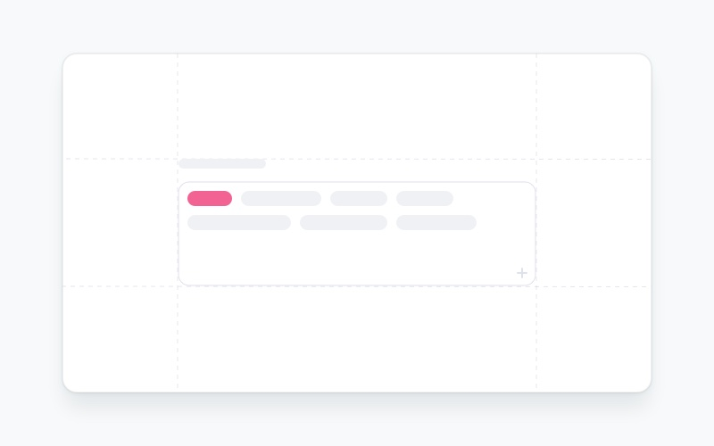
      </a>
    </td>
    <td width="33.3333%" style="padding: 0;">
      <a href="https://www.material-tailwind.com/docs/html/dialog">
        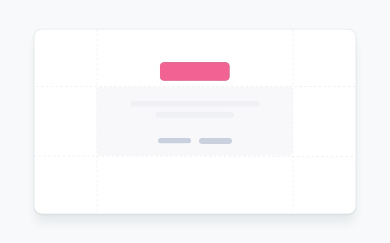
      </a>
    </td>
  </tr>
  <tr>
    <td width="33.3333%">Icon Button</td>
    <td width="33.3333%">Input</td>
    <td width="33.3333%">Menu</td>
  </tr>
  <tr>
    <td width="33.3333%" style="padding: 0;">
      <a href="https://www.material-tailwind.com/docs/html/icon-button">
        
      </a>
    </td>
    <td width="33.3333%" style="padding: 0;">
      <a href="https://www.material-tailwind.com/docs/html/input">
        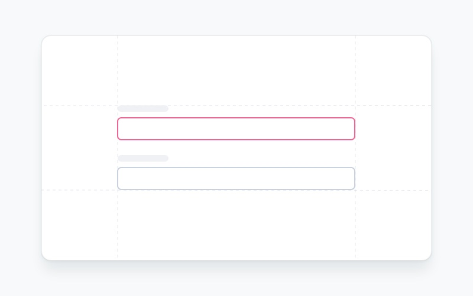
      </a>
    </td>
    <td width="33.3333%" style="padding: 0;">
      <a href="https://www.material-tailwind.com/docs/html/menu">
        
      </a>
    </td>
  </tr>
  <tr>
    <td width="33.3333%">Navbar</td>
    <td width="33.3333%">Pagination</td>
    <td width="33.3333%">Popover</td>
  </tr>
  <tr>
    <td width="33.3333%" style="padding: 0;">
      <a href="https://www.material-tailwind.com/docs/html/navbar">
        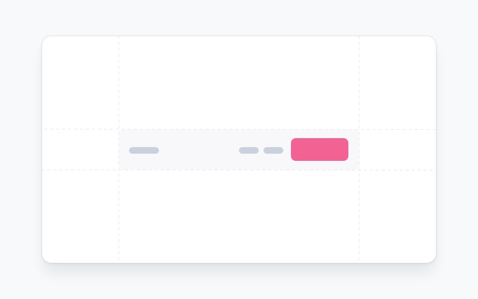
      </a>
    </td>
    <td width="33.3333%" style="padding: 0;">
      <a href="https://www.material-tailwind.com/docs/html/pagination">
        
      </a>
    </td>
    <td width="33.3333%" style="padding: 0;">
      <a href="https://www.material-tailwind.com/docs/html/popover">
        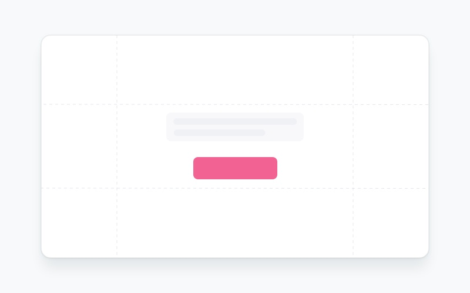
      </a>
    </td>
  </tr>
  <tr>
    <td width="33.3333%">Progress Bar</td>
    <td width="33.3333%">Radio Button</td>
    <td width="33.3333%">Select</td>
  </tr>
  <tr>
    <td width="33.3333%" style="padding: 0;">
      <a href="https://www.material-tailwind.com/docs/html/radio-button">
        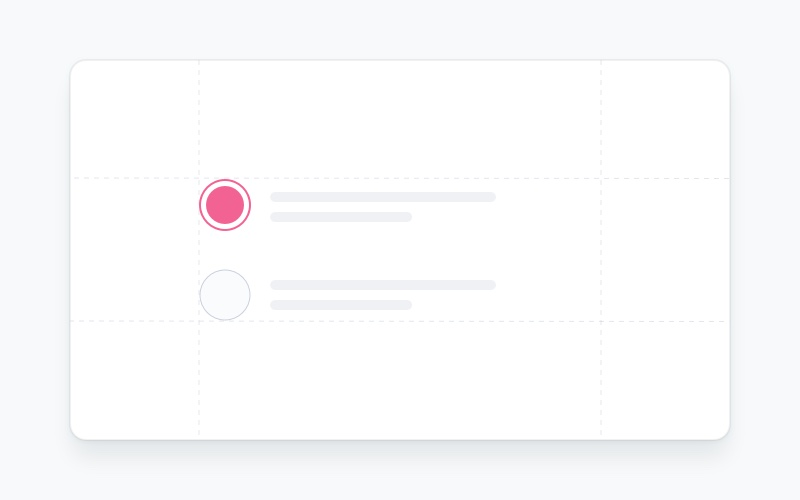
      </a>
    </td>
    <td width="33.3333%" style="padding: 0;">
      <a href="https://www.material-tailwind.com/docs/html/select">
        
      </a>
    </td>
    <td width="33.3333%" style="padding: 0;">
      <a href="https://www.material-tailwind.com/docs/html/progress-bar">
        
      </a>
    </td>
  </tr>
  <tr>
    <td width="33.3333%">Switch</td>
    <td width="33.3333%">Tabs</td>
    <td width="33.3333%">Textarea</td>
  </tr>
  <tr>
    <td width="33.3333%" style="padding: 0;">
      <a href="https://www.material-tailwind.com/docs/html/tabs">
        
      </a>
    </td>
    <td width="33.3333%" style="padding: 0;">
      <a href="https://www.material-tailwind.com/docs/html/textarea">
        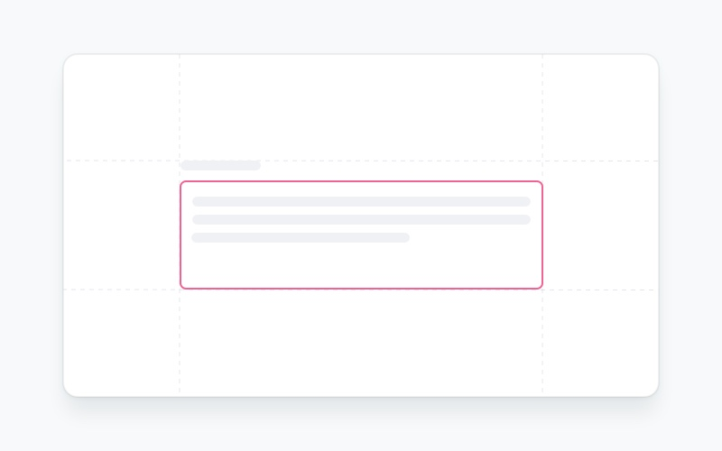
      </a>
    </td>
    <td width="33.3333%" style="padding: 0;">
      <a href="https://www.material-tailwind.com/docs/html/switch">
        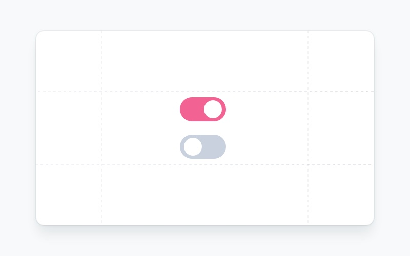
      </a>
    </td>
  </tr>
  <tr>
  <td width="33.3333%">Tooltip</td>
    <td width="33.3333%">Typography</td>
  </tr>
  <tr>
    <td width="33.3333%" style="padding: 0;">
      <a href="https://www.material-tailwind.com/docs/html/typography">
        
      </a>
    </td>
    <td width="33.3333%" style="padding: 0;">
      <a href="https://www.material-tailwind.com/docs/html/tooltip">
        
      </a>
    </td>
  </tr>
</table>

<br />

### Getting Started

Learn how to use @material-tailwind/html components to quickly and easily create elegant and flexible pages using Tailwind CSS.

@material-tailwind/html is working with Tailwind CSS classes and you need to have Tailwind CSS installed on your project - <a href="https://tailwindcss.com/docs/installation?ref=material-tailwind" target="_blank">Tailwind CSS Installation.</a>

<br />

1. Intall `@material-tailwind/html`

```bash
npm i @material-tailwind/html
```

<br />

2. Once you install @material-tailwind/html you need to wrap your tailwind css configurations with the `withMT()` function coming from @material-tailwind/html/utils.

```js
const withMT = require("@material-tailwind/html/utils/withMT");

module.exports = withMT({
  content: ["./index.html"],
  theme: {
    extend: {},
  },
  plugins: [],
});
```

<br />

4. Congratulations 🥳, you did it, now you're ready to use @material-tailwind/html.

```html
<button class="button button-pink">Button</button>
```

<br />
<br />

## Community

We're excited to see the community adopt Material Tailwind, raise issues, and provide feedback.
Whether it's a feature request, bug report, or a project to showcase, please get involved!

- [Discord](https://discord.com/invite/FhCJCaHdQa)

## Contributing

Contributions are always welcome!

See `CONTRIBUTING.md` for ways to get started.

Please adhere to this project's `CODE_OF_CONDUCT.md`.

## License

[MIT](https://github.com/creativetimofficial/material-tailwind/blob/main/LICENSE)
