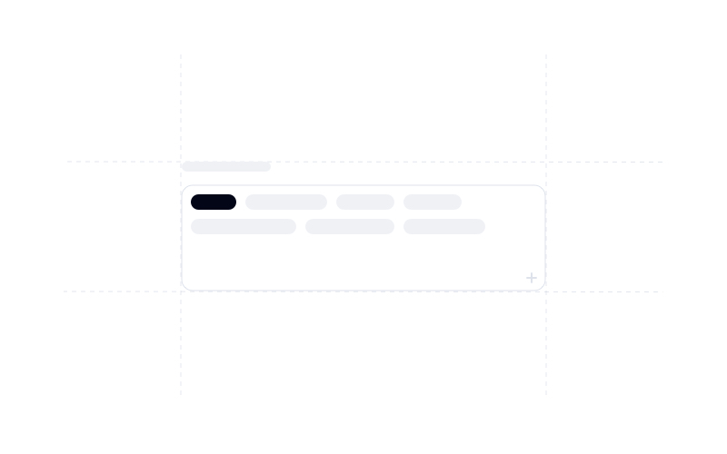
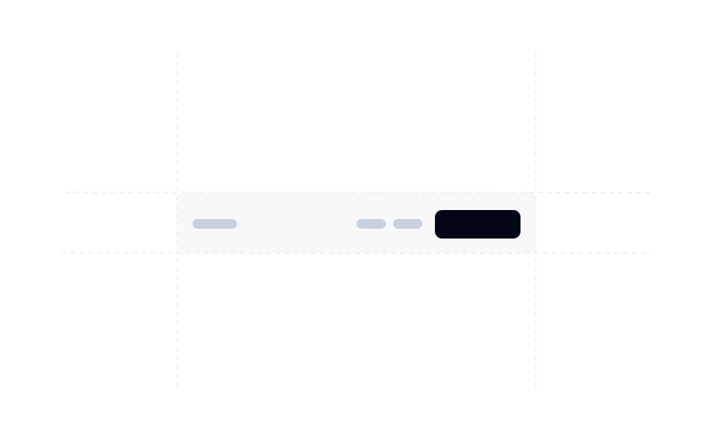
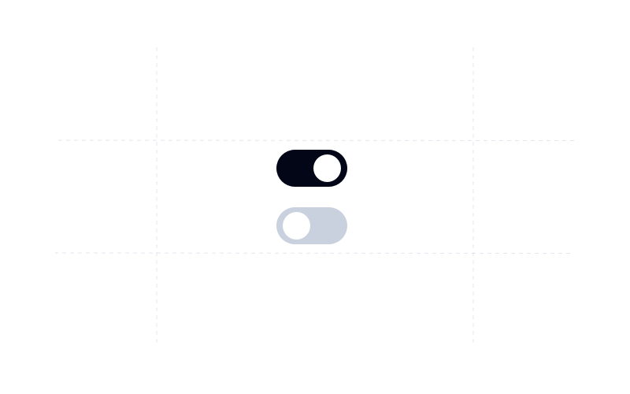
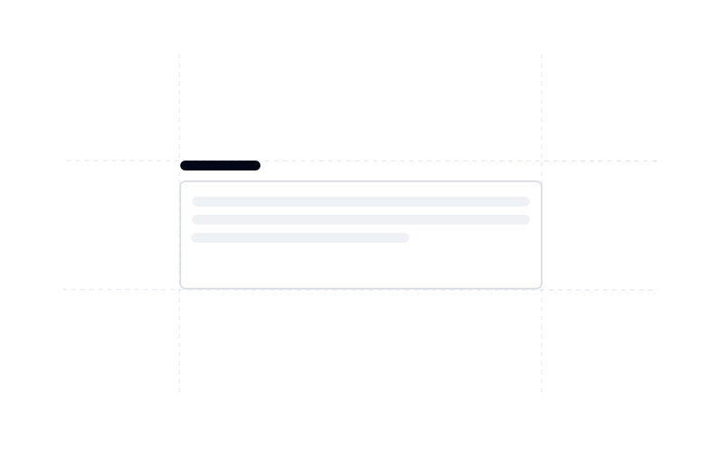

<a href="https://www.material-tailwind.com">
    
    <h1 align="center">Material Tailwind</h1>
</a>
</br>
<p align="center">
  <a href="https://github.com/creativetimofficial/material-tailwind/blob/main/LICENSE">
    
  </a>
  <a href="https://www.npmjs.com/package/@material-tailwind/react">
    
  </a>
  <a href="https://github.com/creativetimofficial/material-tailwind/releases">
    
  </a>
</p>
<p align="center">
  <a href="https://github.com/creativetimofficial/material-tailwind/blob/main/LICENSE">
    
  </a>
  <a href="https://www.npmjs.com/package/@material-tailwind/html">
    
  </a>
  <a href="https://github.com/creativetimofficial/material-tailwind/releases">
    
  </a>
</p>
check local
<p align="center">
  <a href="https://vercel.com/?utm_source=ct-tailwind-team&utm_campaign=oss" target="_blank" rel="noopener noreferrer">
     
  </a>
</p>

<br />
<br />

## @material-tailwind/react

### Documentation

Visit <a href="https://www.material-tailwind.com/docs/react/installation">https://www.material-tailwind.com/docs/react/installation</a> for full documentation.

<br />

### Components

<table>
  <tr>
    <td width="33.3333%">Accordion</td>
    <td width="33.3333%">Alert</td>
    <td width="33.3333%">Avatar</td>
  </tr>
  <tr>
    <td width="33.3333%" style="padding: 0;">
      <a href="https://www.material-tailwind.com/docs/react/accordion">
        
      </a>
    </td>
    <td width="33.3333%" style="padding: 0;">
      <a href="https://www.material-tailwind.com/docs/react/alert">
        
      </a>
    </td>
    <td width="33.3333%" style="padding: 0;">
      <a href="https://www.material-tailwind.com/docs/react/avatar">
        
      </a>
    </td>
  </tr>
  <tr>
    <td width="33.3333%">Badge</td>
    <td width="33.3333%">Breadcrumbs</td>
    <td width="33.3333%">Button</td>
  </tr>
  <tr>
    <td width="33.3333%" style="padding: 0;">
      <a href="https://www.material-tailwind.com/docs/react/badge">
        
      </a>
    </td>
    <td width="33.3333%" style="padding: 0;">
      <a href="https://www.material-tailwind.com/docs/react/breadcrumbs">
        
      </a>
    </td>
    <td width="33.3333%" style="padding: 0;">
      <a href="https://www.material-tailwind.com/docs/react/button">
        
      </a>
    </td>
  </tr>
  <tr>
    <td width="33.3333%">Button Group</td>
    <td width="33.3333%">Card</td>
    <td width="33.3333%">Checkbox</td>
  </tr>
  <tr>
    <td width="33.3333%" style="padding: 0;">
      <a href="https://www.material-tailwind.com/docs/react/button-group">
        
      </a>
    </td>
    <td width="33.3333%" style="padding: 0;">
      <a href="https://www.material-tailwind.com/docs/react/card">
        
      </a>
    </td>
    <td width="33.3333%" style="padding: 0;">
      <a href="https://www.material-tailwind.com/docs/react/checkbox">
        
      </a>
    </td>
  </tr>
  <tr>
    <td width="33.3333%">Chip</td>
    <td width="33.3333%">Collapse</td>
    <td width="33.3333%">Carousel</td>
  </tr>
  <tr>
    <td width="33.3333%" style="padding: 0;">
      <a href="https://www.material-tailwind.com/docs/react/chip">
        
      </a>
    </td>
    <td width="33.3333%" style="padding: 0;">
      <a href="https://www.material-tailwind.com/docs/react/collapse">
        
      </a>
    </td>
    <td width="33.3333%" style="padding: 0;">
      <a href="https://www.material-tailwind.com/docs/react/carousel">
        
      </a>
    </td>
  </tr>
  <tr>
    <td width="33.3333%">Dialog</td>
    <td width="33.3333%">Drawer</td>
    <td width="33.3333%">Icon Button</td>
  </tr>
  <tr>
    <td width="33.3333%" style="padding: 0;">
      <a href="https://www.material-tailwind.com/docs/react/dialog">
        
      </a>
    </td>
    <td width="33.3333%" style="padding: 0;">
      <a href="https://www.material-tailwind.com/docs/react/drawer">
        
      </a>
    </td>
    <td width="33.3333%" style="padding: 0;">
      <a href="https://www.material-tailwind.com/docs/react/icon-button">
        
      </a>
    </td>
  </tr>
  <tr>
    <td width="33.3333%">Input</td>
    <td width="33.3333%">Form</td>
    <td width="33.3333%">List</td>
  </tr>
  <tr>
    <td width="33.3333%" style="padding: 0;">
      <a href="https://www.material-tailwind.com/docs/react/input">
        
      </a>
    </td>
    <td width="33.3333%" style="padding: 0;">
      <a href="https://www.material-tailwind.com/docs/react/form">
        
      </a>
    </td>
    <td width="33.3333%" style="padding: 0;">
      <a href="https://www.material-tailwind.com/docs/react/list">
        
      </a>
    </td>
  </tr>
  <tr>
    <td width="33.3333%">Menu</td>
    <td width="33.3333%">Navbar</td>
    <td width="33.3333%">Popover</td>
  </tr>
  <tr>
    <td width="33.3333%" style="padding: 0;">
      <a href="https://www.material-tailwind.com/docs/react/menu">
        
      </a>
    </td>
    <td width="33.3333%" style="padding: 0;">
      <a href="https://www.material-tailwind.com/docs/react/navbar">
        
      </a>
    </td>
    <td width="33.3333%" style="padding: 0;">
      <a href="https://www.material-tailwind.com/docs/react/popover">
        
      </a>
    </td>
  </tr>
  <tr>
    <td width="33.3333%">Progress Bar</td>
    <td width="33.3333%">Pagination</td>
    <td width="33.3333%">Radio Button</td>
  </tr>
  <tr>
    <td width="33.3333%" style="padding: 0;">
      <a href="https://www.material-tailwind.com/docs/react/progress-bar">
        
      </a>
    </td>
    <td width="33.3333%" style="padding: 0;">
      <a href="https://www.material-tailwind.com/docs/react/pagination">
        
      </a>
    </td>
    <td width="33.3333%" style="padding: 0;">
      <a href="https://www.material-tailwind.com/docs/react/radio-button">
        
      </a>
    </td>
  </tr>
  <tr>
    <td width="33.3333%">Rating Bar</td>
    <td width="33.3333%">Select</td>
    <td width="33.3333%">Slider</td>
  </tr>
  <tr>
    <td width="33.3333%" style="padding: 0;">
      <a href="https://www.material-tailwind.com/docs/react/rating-bar">
        
      </a>
    </td>
    <td width="33.3333%" style="padding: 0;">
      <a href="https://www.material-tailwind.com/docs/react/select">
        
      </a>
    </td>
    <td width="33.3333%" style="padding: 0;">
      <a href="https://www.material-tailwind.com/docs/react/slider">
        
      </a>
    </td>
  </tr>
  <tr>
    <td width="33.3333%">Speed Dial</td>
    <td width="33.3333%">Spinner</td>
    <td width="33.3333%">Stepper</td>
  </tr>
  <tr>
    <td width="33.3333%" style="padding: 0;">
      <a href="https://www.material-tailwind.com/docs/react/speed-dial">
        
      </a>
    </td>
    <td width="33.3333%" style="padding: 0;">
      <a href="https://www.material-tailwind.com/docs/react/spinner">
        
      </a>
    </td>
    <td width="33.3333%" style="padding: 0;">
      <a href="https://www.material-tailwind.com/docs/react/stepper">
        
      </a>
    </td>
  </tr>
  <tr>
    <td width="33.3333%">Switch</td>
    <td width="33.3333%">Tabs</td>
    <td width="33.3333%">Text Area</td>
  </tr>
  <tr>
    <td width="33.3333%" style="padding: 0;">
      <a href="https://www.material-tailwind.com/docs/react/switch">
        
      </a>
    </td>
    <td width="33.3333%" style="padding: 0;">
      <a href="https://www.material-tailwind.com/docs/react/tabs">
        
      </a>
    </td>
    <td width="33.3333%" style="padding: 0;">
      <a href="https://www.material-tailwind.com/docs/react/textarea">
        
      </a>
    </td>
  </tr>
  <tr>
    <td width="33.3333%">Timeline</td>
    <td width="33.3333%">Tooltip</td>
    <td width="33.3333%">Typography</td>
  </tr>
  <tr>
    <td width="33.3333%" style="padding: 0;">
      <a href="https://www.material-tailwind.com/docs/react/timeline">
        
      </a>
    </td>
    <td width="33.3333%" style="padding: 0;">
      <a href="https://www.material-tailwind.com/docs/react/tooltip">
        
      </a>
    </td>
    <td width="33.3333%" style="padding: 0;">
      <a href="https://www.material-tailwind.com/docs/react/typography">
        
      </a>
    </td>
  </tr>
  <tr>
    <td width="33.3333%">Footer</td>
    <td width="33.3333%">Image</td>
    <td width="33.3333%">Video</td>
  </tr>
  <tr>
    <td width="33.3333%" style="padding: 0;">
      <a href="https://www.material-tailwind.com/docs/react/footer">
        
      </a>
    </td>
    <td width="33.3333%" style="padding: 0;">
      <a href="https://www.material-tailwind.com/docs/react/img">
        
      </a>
    </td>
    <td width="33.3333%" style="padding: 0;">
      <a href="https://www.material-tailwind.com/docs/react/video">
        
      </a>
    </td>
  </tr>
  <tr>
    <td width="33.3333%">Sidebar</td>
    <td width="33.3333%">Table</td>
  </tr>
  <tr>
    <td width="33.3333%" style="padding: 0;">
      <a href="https://www.material-tailwind.com/docs/react/sidebar">
        
      </a>
    </td>
    <td width="33.3333%" style="padding: 0;">
      <a href="https://www.material-tailwind.com/docs/react/table">
        
      </a>
    </td>
  </tr>
</table>

<br />

### Getting Started

Learn how to use @material-tailwind/react components to quickly and easily create elegant and flexible pages using Tailwind CSS.

@material-tailwind/react is working with Tailwind CSS classes and you need to have Tailwind CSS installed on your project - <a href="https://tailwindcss.com/docs/installation/framework-guides?ref=material-tailwind" target="_blank">Tailwind CSS Installation.</a>

<br />

1. Install `@material-tailwind/react`.

```bash
npm i @material-tailwind/react
```

<br />

2. Once you install @material-tailwind/react you need to wrap your tailwind css configurations with the `withMT()` function coming from @material-tailwind/react/utils.

```js
const withMT = require("@material-tailwind/react/utils/withMT");

module.exports = withMT({
  content: ["./src/**/*.{js,jsx,ts,tsx}"],
  theme: {
    extend: {},
  },
  plugins: [],
});
```

<br />

3. @material-tailwind/react comes with a theme provider that set's the default theme/styles for components or to provide your own theme/styles to your components. You need to wrap your entire application with the `ThemeProvider` coming from @material-tailwind/react.

```jsx
import React from "react";
import ReactDOM from "react-dom/client";
import App from "./App";

// @material-tailwind/react
import { ThemeProvider } from "@material-tailwind/react";

const root = ReactDOM.createRoot(document.getElementById("root"));

root.render(
  <React.StrictMode>
    <ThemeProvider>
      <App />
    </ThemeProvider>
  </React.StrictMode>,
);
```

<br />

4. Congratulations 🥳, you did it, now you're ready to use @material-tailwind/react.

```jsx
import { Button } from "@material-tailwind/react";

export default function Example() {
  return <Button>Button</Button>;
}
```

<br />

## @material-tailwind/html

### Documentation

Visit <a href="https://www.material-tailwind.com/docs/html/installation">https://www.material-tailwind.com/docs/html/installation</a> for full documentation.

<br />

### Components

<table>
  <tr>
    <td width="33.3333%">Accordion</td>
    <td width="33.3333%">Alert</td>
    <td width="33.3333%">Avatar</td>
  </tr>
  <tr>
    <td width="33.3333%" style="padding: 0;">
      <a href="https://www.material-tailwind.com/docs/html/accordion">
        
      </a>
    </td>
    <td width="33.3333%" style="padding: 0;">
      <a href="https://www.material-tailwind.com/docs/html/alert">
        
      </a>
    </td>
    <td width="33.3333%" style="padding: 0;">
      <a href="https://www.material-tailwind.com/docs/html/avatar">
        
      </a>
    </td>
  </tr>
  <tr>
    <td width="33.3333%">Breadcrumbs</td>
    <td width="33.3333%">Button</td>
    <td width="33.3333%">Card</td>
  </tr>
  <tr>
    <td width="33.3333%" style="padding: 0;">
      <a href="https://www.material-tailwind.com/docs/html/breadcrumbs">
        
      </a>
    </td>
    <td width="33.3333%" style="padding: 0;">
      <a href="https://www.material-tailwind.com/docs/html/button">
        
      </a>
    </td>
    <td width="33.3333%" style="padding: 0;">
      <a href="https://www.material-tailwind.com/docs/html/card">
        
      </a>
    </td>
  </tr>
  <tr>
    <td width="33.3333%">Checkbox</td>
    <td width="33.3333%">Chip</td>
    <td width="33.3333%">Dialog</td>
  </tr>
  <tr>
    <td width="33.3333%" style="padding: 0;">
      <a href="https://www.material-tailwind.com/docs/html/checkbox">
        
      </a>
    </td>
    <td width="33.3333%" style="padding: 0;">
      <a href="https://www.material-tailwind.com/docs/html/chip">
        
      </a>
    </td>
    <td width="33.3333%" style="padding: 0;">
      <a href="https://www.material-tailwind.com/docs/html/dialog">
        
      </a>
    </td>
  </tr>
  <tr>
    <td width="33.3333%">Icon Button</td>
    <td width="33.3333%">Input</td>
    <td width="33.3333%">Menu</td>
  </tr>
  <tr>
    <td width="33.3333%" style="padding: 0;">
      <a href="https://www.material-tailwind.com/docs/html/icon-button">
        
      </a>
    </td>
    <td width="33.3333%" style="padding: 0;">
      <a href="https://www.material-tailwind.com/docs/html/input">
        
      </a>
    </td>
    <td width="33.3333%" style="padding: 0;">
      <a href="https://www.material-tailwind.com/docs/html/menu">
        
      </a>
    </td>
  </tr>
  <tr>
    <td width="33.3333%">Navbar</td>
    <td width="33.3333%">Pagination</td>
    <td width="33.3333%">Popover</td>
  </tr>
  <tr>
    <td width="33.3333%" style="padding: 0;">
      <a href="https://www.material-tailwind.com/docs/html/navbar">
        
      </a>
    </td>
    <td width="33.3333%" style="padding: 0;">
      <a href="https://www.material-tailwind.com/docs/html/pagination">
        
      </a>
    </td>
    <td width="33.3333%" style="padding: 0;">
      <a href="https://www.material-tailwind.com/docs/html/popover">
        
      </a>
    </td>
  </tr>
  <tr>
    <td width="33.3333%">Progress Bar</td>
    <td width="33.3333%">Radio Button</td>
    <td width="33.3333%">Select</td>
  </tr>
  <tr>
    <td width="33.3333%" style="padding: 0;">
      <a href="https://www.material-tailwind.com/docs/html/radio-button">
        
      </a>
    </td>
    <td width="33.3333%" style="padding: 0;">
      <a href="https://www.material-tailwind.com/docs/html/select">
        
      </a>
    </td>
    <td width="33.3333%" style="padding: 0;">
      <a href="https://www.material-tailwind.com/docs/html/progress-bar">
        
      </a>
    </td>
  </tr>
  <tr>
    <td width="33.3333%">Switch</td>
    <td width="33.3333%">Tabs</td>
    <td width="33.3333%">Textarea</td>
  </tr>
  <tr>
    <td width="33.3333%" style="padding: 0;">
      <a href="https://www.material-tailwind.com/docs/html/tabs">
        
      </a>
    </td>
    <td width="33.3333%" style="padding: 0;">
      <a href="https://www.material-tailwind.com/docs/html/textarea">
        
      </a>
    </td>
    <td width="33.3333%" style="padding: 0;">
      <a href="https://www.material-tailwind.com/docs/html/switch">
        
      </a>
    </td>
  </tr>
  <tr>
  <td width="33.3333%">Tooltip</td>
    <td width="33.3333%">Typography</td>
  </tr>
  <tr>
    <td width="33.3333%" style="padding: 0;">
      <a href="https://www.material-tailwind.com/docs/html/typography">
        
      </a>
    </td>
    <td width="33.3333%" style="padding: 0;">
      <a href="https://www.material-tailwind.com/docs/html/tooltip">
        
      </a>
    </td>
  </tr>
</table>

<br />

### Getting Started

Learn how to use @material-tailwind/html components to quickly and easily create elegant and flexible pages using Tailwind CSS.

@material-tailwind/html is working with Tailwind CSS classes and you need to have Tailwind CSS installed on your project - <a href="https://tailwindcss.com/docs/installation?ref=material-tailwind" target="_blank">Tailwind CSS Installation.</a>

<br />

1. Install `@material-tailwind/html`

```bash
npm i @material-tailwind/html
```

<br />

2. Once you install @material-tailwind/html you need to wrap your tailwind css configurations with the `withMT()` function coming from @material-tailwind/html/utils.

```js
const withMT = require("@material-tailwind/html/utils/withMT");

module.exports = withMT({
  content: ["./index.html"],
  theme: {
    extend: {},
  },
  plugins: [],
});
```

<br />

4. Congratulations 🥳, you did it, now you're ready to use @material-tailwind/html.

<br />
<br />

## Community

We're excited to see the community adopt Material Tailwind, raise issues, and provide feedback.
Whether it's a feature request, bug report, or a project to showcase, please get involved!

- [Discord](https://discord.com/invite/FhCJCaHdQa)

## Contributing

Contributions are always welcome!

See `CONTRIBUTING.md` for ways to get started.

Please adhere to this project's `CODE_OF_CONDUCT.md`.

## License

[MIT](https://github.com/creativetimofficial/material-tailwind/blob/main/LICENSE)

## Color mappings

| Custom Class                         | Tailwind Class                         |
| ------------------------------------ | -------------------------------------- |
| `text-inherit`                       | `text-current`                         |
| `text-foreground`                    | `text-slate-600`                       |
| `text-primary`                       | `text-slate-800`                       |
| `text-black`                         | `text-slate-800`                       |
| `text-foreground/60`                 | `text-slate-600/60`                    |
| `text-primary-foreground`            | `text-slate-50`                        |
| `text-secondary-foreground`          | `text-slate-800`                       |
| `text-secondary`                     | `text-slate-200`                       |
| `text-success`                       | `text-green-500`                       |
| `text-error`                         | `text-red-500`                         |
| `text-warning`                       | `text-amber-500`                       |
| `text-warning-foreground`            | `text-amber-50`                        |
| `text-success-foreground`            | `text-green-50`                        |
| `text-error-foreground`              | `text-red-50`                          |
| `text-info-foreground`               | `text-blue-50`                         |
| `text-info`                          | `text-blue-500`                        |
| `text-foreground/70`                 | `text-slate-600/70`                    |
| `bg-primary/10`                      | `bg-slate-800/10`                      |
| `bg-warning`                         | `bg-amber-500`                         |
| `bg-info`                            | `bg-blue-500`                          |
| `bg-success`                         | `bg-green-500`                         |
| `bg-success/10`                      | `bg-green-500/10`                      |
| `bg-error/10`                        | `bg-red-500/10`                        |
| `bg-primary-light`                   | `bg-slate-700`                         |
| `bg-primary`                         | `bg-slate-800`                         |
| `bg-black`                           | `bg-slate-950`                         |
| `bg-background`                      | `bg-white`                             |
| `bg-secondary`                       | `bg-slate-200`                         |
| `bg-secondary-light`                 | `bg-slate-100`                         |
| `bg-surface-light`                   | `bg-slate-100`                         |
| `bg-surface`                         | `bg-slate-200`                         |
| `bg-surface/20`                      | `bg-slate-200/20`                      |
| `bg-error`                           | `bg-red-500`                           |
| `data-[checked=true]:border-primary` | `data-[checked=true]:border-slate-800` |
| `data-[checked=true]:bg-primary`     | `data-[checked=true]:bg-slate-800`     |
| `before:bg-surface`                  | `before:bg-slate-200`                  |
| `after:border-surface`               | `after:border-slate-200`               |
| `after:bg-background`                | `after:bg-white`                       |
| `checked:before:bg-primary`          | `checked:before:bg-slate-800`          |
| `checked:after:border-primary`       | `checked:after:border-slate-800`       |
| `active:ring-primary/10`             | `active:ring-slate-800/10`             |
| `shadow-black/5`                     | `shadow-slate-950/5`                   |
| `shadow-primary-dark/25`             | `shadow-slate-950/25`                  |
| `placeholder:text-foreground/60`     | `placeholder:text-slate-600/60`        |
| `hover:bg-primary-light`             | `hover:bg-slate-700`                   |
| `hover:border-primary-light`         | `hover:border-slate-700`               |
| `hover:bg-secondary`                 | `hover:bg-slate-200`                   |
| `hover:bg-secondary/10`              | `hover:bg-slate-200/10`                |
| `hover:bg-secondary-light`           | `hover:bg-slate-100`                   |
| `hover:border-secondary-light`       | `hover:bg-slate-100`                   |
| `hover:border-secondary/10`          | `hover:border-slate-600/10`            |
| `hover:border-secondary`             | `hover:border-slate-500`               |
| `hover:bg-error/10`                  | `hover:bg-red-500/10`                  |
| `hover:bg-primary/5`                 | `hover:bg-slate-800/5`                 |
| `hover:border-primary/5`             | `hover:border-slate-800/5`             |
| `hover:ring-primary/10`              | `hover:ring-slate-800/10`              |
| `hover:border-primary`               | `hover:border-slate-800`               |
| `hover:bg-error`                     | `hover:bg-red-500`                     |
| `hover:text-error-foreground`        | `hover:text-red-50`                    |
| `hover:text-black`                   | `hover:text-slate-800`                 |
| `hover:bg-surface`                   | `hover:bg-slate-200`                   |
| `focus:text-black`                   | `focus:text-slate-800`                 |
| `focus:border-primary`               | `focus:border-slate-800`               |
| `focus:ring-primary/10`              | `focus:ring-slate-800/10`              |
| `focus:bg-surface`                   | `focus:bg-slate-200`                   |
| `border-info`                        | `border-blue-500`                      |
| `border-warning`                     | `border-amber-500`                     |
| `border-primary`                     | `border-slate-800`                     |
| `border-secondary-light`             | `border-slate-100`                     |
| `border-primary-dark`                | `border-slate-950`                     |
| `border-primary-light`               | `border-slate-700`                     |
| `border-surface`                     | `border-slate-200`                     |
| `border-secondary`                   | `border-slate-200`                     |
| `border-success`                     | `border-green-500`                     |
| `border-error`                       | `border-red-500`                       |
| `border-error/10`                    | `border-red-500/10`                    |
| `shadow-black/10`                    | `shadow-slate-800/10`                  |
| `peer-focus:text-black`              | `peer-focus:text-slate-800`            |
| `peer-hover:text-black`              | `peer-focus:text-slate-800`            |
| `data-[icon-placement=start]`        | ``                                     |
| `data-[icon-placement=end]`          | ``                                     |
| `font-inherit`                       | `font-sans`                            |
| `shadow-none`                        | `shadow-none`                          |
